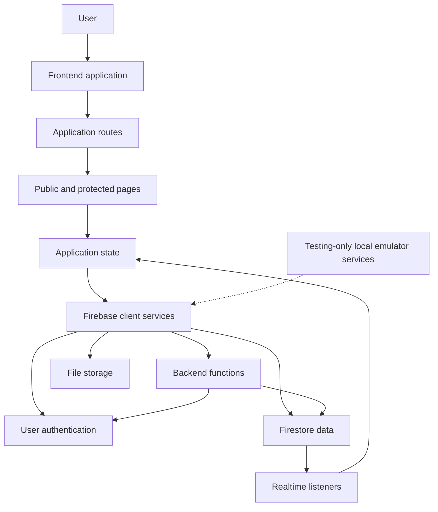

# SkillForge

SkillForge is a skill-learning web application where users discover skills, request learning sessions, communicate with other learners and mentors, and manage their profiles.

The application uses React, TypeScript, Vite, Firebase Authentication, Cloud Firestore, callable Cloud Functions, Firebase Storage, Zustand, and React Router. Firebase emulators are used for local end-to-end testing.

## Current System



## What SkillForge Does

Users can:

- create an account and complete four-step onboarding
- publish and manage the skills they offer
- discover skills from other users
- send and manage skill requests
- use coins as request escrow
- communicate through chat after a request is accepted
- update their profile, settings, theme, and account

## Documentation

The documentation is organized around the system's current boundaries:

- [System Overview](./docs/system-overview.md): product capabilities, runtime boundaries, current architecture, and architectural evolution.
- [Architecture](./docs/architecture.md): frontend layers, routes, state ownership, realtime listeners, backend boundaries, and local/CI runtime.
- [Authentication](./docs/authentication.md): Firebase auth resolution, four-step onboarding, public/protected route gates, and test boundaries.
- [Firestore Data Model](./docs/firestore-data-model.md): collections, subcollections, document fields, relationships, write ownership, and realtime queries.

## Application Structure

```text
src/
	components/       Shared UI, layouts, dialogs, modals, and skeletons
	context/          React contexts for sidebar, skills, and chat
	firebase/         Firebase client and Firestore listeners
	hooks/            Reusable auth, presence, and messaging hooks
	initializer/      Application-wide auth and realtime initialization
	layouts/          Landing and authenticated dashboard shells
	pages/            Auth, dashboard, discover, messages, profile, settings, and requests
	routes/           Route tree, guards, lazy loading, and error handling
	store/            Zustand application stores
	utils/            Shared formatting and messaging utilities

functions/
	src/auth/         Account creation, signup finalization, and deletion
	src/chat/         Durable message and system-message operations
	src/coins/        Skill-request escrow helpers
	src/skillRequest/ Request lifecycle and completion operations
```

## Local Development

Install dependencies and start the Vite application:

```bash
npm ci
npm run dev
```

Build the Firebase Functions package when backend code changes:

```bash
npm --prefix functions ci
npm --prefix functions run build
```

The Firebase Emulator Suite is configured in `firebase.json`. Playwright starts the Vite server and emulator process for E2E runs through `playwright.config.ts`.

## Testing

Run unit tests:

```bash
npm run test:unit
```

Run the Playwright suite across Chromium, Firefox, and WebKit:

```bash
npm run test:e2e
```

For the exact auth behavior and E2E state-seeding boundary, see [Authentication](./docs/authentication.md). For the emulator and CI runtime, see [Architecture](./docs/architecture.md).

## Current Design Principles

- Firebase Authentication identifies users; Firestore stores the SkillForge profile and application data.
- Route guards control navigation, while callable Functions enforce authenticated multi-document operations.
- Firestore listeners keep skills, requests, chats, profiles, and threads synchronized with the UI.
- Zustand stores own cross-page state; React contexts own subtree-specific state and forms.
- Sensitive workflows such as request creation, coin escrow, request acceptance, and completion settlement are coordinated on the backend.
