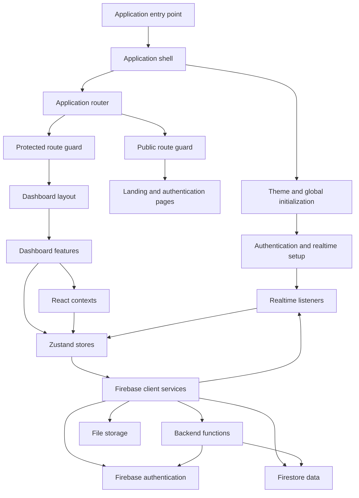
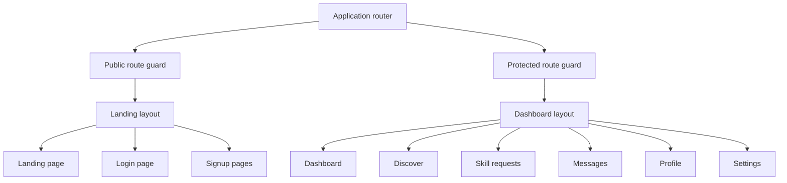
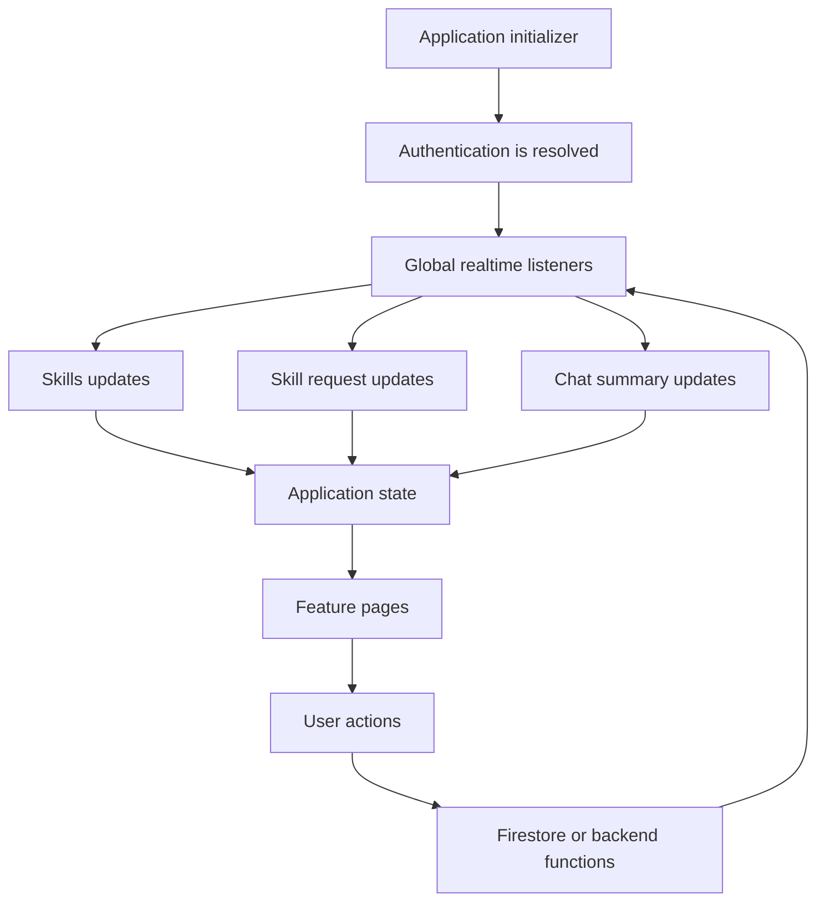
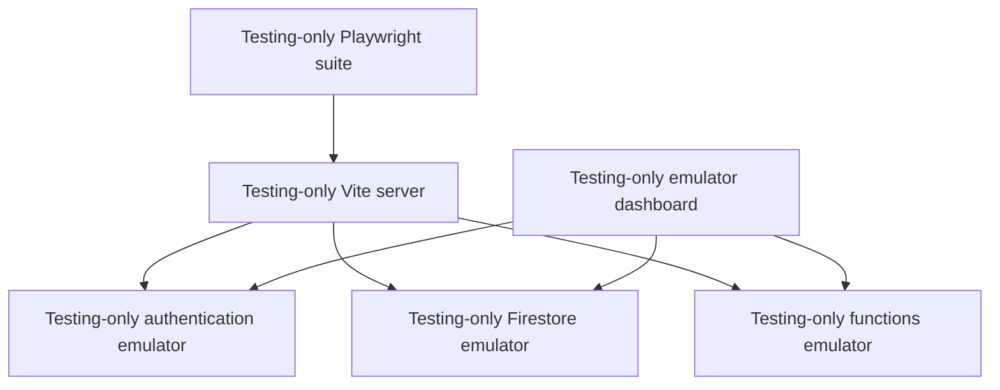

# SkillForge Architecture

SkillForge is a client-rendered React application organized around route layouts, feature pages, Zustand stores, React contexts, Firebase client services, Firestore listeners, and callable Cloud Functions.

For a system-level description, see [System Overview](./system-overview.md). For auth-specific control flow, see [Authentication](./authentication.md). For persisted entities and relationships, see [Firestore Data Model](./firestore-data-model.md).

## Architectural Shape

## Application Bootstrap

1. `src/main.tsx` renders the React application.
2. `src/App.tsx` initializes the theme and reacts to system color-scheme changes.
3. `AppInitializer` starts the auth listener unless the E2E skip flag is present.
4. `SkillsProvider` supplies the React Hook Form instances used by skill-related flows.
5. `AppRoutes` renders public or protected route trees.
6. Route guards wait for `authResolved` and `loading` before deciding whether to render or redirect.

The Firebase client is initialized in `src/firebase/firebase.ts`. When `VITE_APP_ENV === "e2e"`, the client connects Auth, Firestore, and Functions to the local emulator hosts.

## Route and Layout Architecture

`AppRoutes` lazy-loads most feature pages and pairs them with dedicated skeleton fallbacks through `LazyWrapper`. `SidebarProvider` is scoped to the dashboard layout, while `ChatProvider` is scoped to message routes.

## State Ownership

### Zustand stores

- `useAuthStore`: Firebase auth actions, persisted current user, auth loading, auth resolution, and login/signup errors.
- `useMultiStepsStore`: onboarding step state and temporary skill-form behavior.
- `useChatStore`: chat summaries, thread messages, and offline outbox state.
- `useRequestsStore`: skill-request records, loading state, and callable request actions.
- `useUsersAndSkillsStore`: Discover users and skills.
- `useProfileStore`: profile edits, skills, and profile-related updates.
- `useSettingsStore`: password/account settings and account deletion state.
- `useThemeStore`: light, dark, and system theme state.

### React contexts

- `useSidebarContext`: responsive dashboard sidebar state.
- `useSkillsContext`: skill form instances shared by onboarding/profile flows.
- `useChatContext`: active thread, thread listener lifecycle, message form, and optimistic sending.

The stores hold cross-page state and server-shaped data. Contexts are used where state is tightly coupled to a subtree or form lifecycle.

## Realtime Data Flow

Global listeners are mounted in `AppInitializer` for skills, skill requests, and chat summaries. Profile and chat-thread listeners are mounted closer to their feature pages so their lifetimes follow the active view.

## Backend Boundary

Direct client Firestore operations are used for reads, profile updates, presence, chat delivery/read metadata, and user skill synchronization. Callable Functions are used when the operation needs authenticated server checks, a transaction, or coordinated writes across multiple documents.

The exported Functions are:

- `createInitialUserDoc`
- `finalizeSignup`
- `deleteAccount`
- `sendSkillRequest`
- `cancelSkillRequest`
- `declineSkillRequest`
- `acceptSkillRequest`
- `requestSkillCompletion`
- `confirmSkillCompletion`
- `sendMessage`

The backend source is grouped by domain under `functions/src/auth`, `functions/src/skillRequest`, `functions/src/chat`, and `functions/src/coins`.

## Local and CI Architecture

The Playwright configuration starts Vite and the Firebase emulator process through its `webServer` entries. E2E mode is selected with `VITE_APP_ENV=e2e`, which makes the client connect to the emulator endpoints. CI sets `CI`, causing Playwright to use one worker, retries, and a non-reused server.

## Evolution Notes

The architecture started as a Vite/React/Firebase client with authentication and storage. It later gained route layouts, Discover, skill requests, chat, profile synchronization, and coins. The largest boundary change was moving skill-request coordination from an early user-nested model into top-level `skillRequests` documents and callable Functions that atomically update requests, users, chats, skills, and coin transfers.
