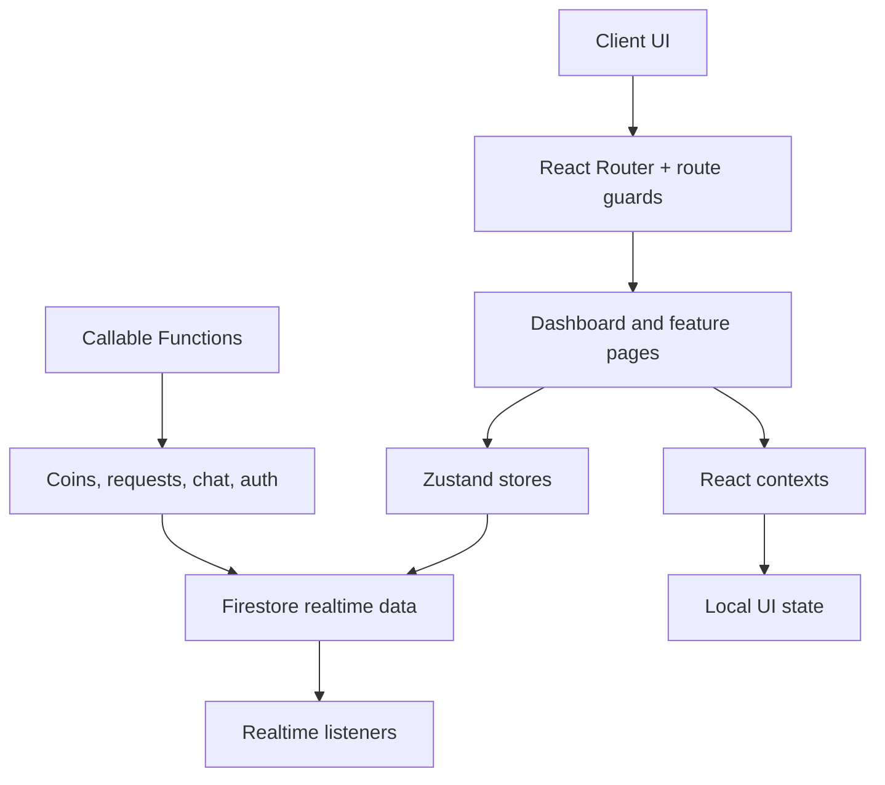
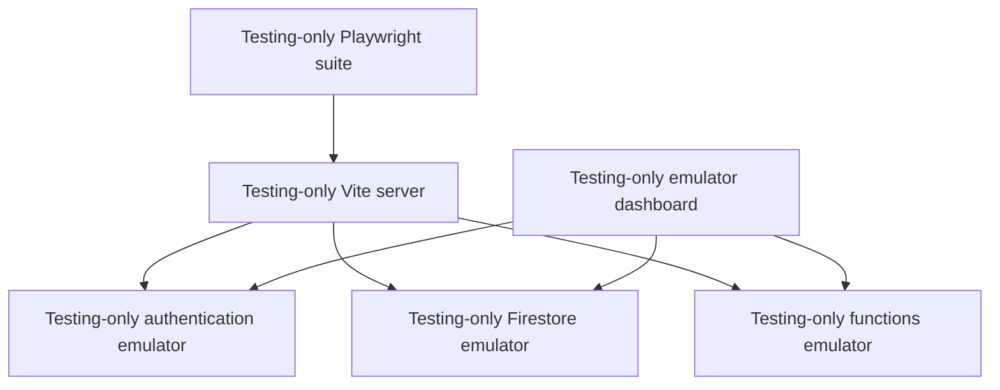

# SkillForge Architecture

SkillForge is a Firebase-first React app built around route guards, realtime listeners, Zustand stores, contextual UI state, and callable backend functions. The app is organized around a simple rule: the browser handles presentation and user flow, while the backend owns sensitive multi-document actions.

## High-level view

## Main architectural decisions

- Route and feature boundaries are split by page and lifetime.
- Global state lives in Zustand for shared, server-backed data.
- Local UI state lives in React context for forms and route-scoped interactions.
- Realtime listeners are mounted only where they are needed and cleaned up when the route is no longer active.
- Sensitive workflows such as request creation, settlement, and chat writes are enforced in callable backend Functions.

## Detailed design notes

- [Messaging Architecture](./messaging-architecture.md): chat summary model, optimistic sending, outbox retry flow, delivery/read state.
- [Skill-Request Lifecycle](./skill-request-lifecycle.md): request state machine, coin escrow, transactional updates, completion and settlement.
- [Testing Architecture](./testing-architecture.md): emulator-boundary reasoning, unit vs E2E split, browser matrix, CI behavior.
- [Frontend Performance and Architecture Decisions](./frontend-performance-architecture.md): lazy routes, listener lifecycle, state ownership, and performance decisions.

For auth specifics, see [Authentication](./authentication.md). For Firestore shapes, see [Firestore Data Model](./firestore-data-model.md).

Performance is treated as a structural concern. The app is designed to avoid loading and rendering everything up front, keep active state local to the feature that owns it, and shut down listeners when they are no longer relevant.

### Lazy routes and progressive loading

Route-level lazy loading is used for the dashboard, discover, messages, profile, and settings pages. The route tree is intentionally split so the initial shell loads quickly and feature bundles are only fetched when the user actually navigates there.

Skeleton fallbacks are not decoration; they are part of the loading contract. They preserve layout stability while lazy bundles resolve, which prevents the app from feeling like it is reflowing unpredictably under route transitions.

### Listener lifecycle and cleanup

Global listeners are started in one app initializer only after auth is resolved. Feature-specific listeners are mounted closer to their route and cleaned up on unmount. This reduces memory churn and avoids stale subscriptions after navigation.

The design rule is that every listener has a clearly scoped lifetime. If a page or feature is no longer active, its listeners are torn down rather than left alive in the background.

### State ownership decisions

State ownership is deliberately divided by scope:

- `Zustand` stores own cross-page, server-shaped, and durable state such as auth, request lists, chat summaries, and derived application data.
- `React Context` owns subtree-scoped concerns such as sidebar state, chat form state, and shared form instances that are tightly bound to a route or component tree.

This split is practical, not theoretical. We do not keep route-specific UI concerns in global stores, and we do not duplicate server-state details in many contexts. The state boundary is shaped around persistence, update frequency, and lifetime.

### Why certain state stays in Zustand vs Context

State belongs in Zustand when it is:

- needed across multiple pages,
- backed by Firestore or auth reality,
- updated by realtime listeners,
- required to keep relationships consistent across navigation.

State belongs in Context when it is:

- tightly bound to a single feature subtree,
- ephemeral to a form or route interaction,
- not important outside the active UI surface.

This is why chat summary state is store-owned while the active chat input and thread form logic remain context-owned: the former is shared and persistent across the app, while the latter is route-local and interaction-specific.

The result is a frontend that is responsive, resilient under realtime updates, and maintainable without scattering route-level logic across unrelated global state.

Direct client Firestore operations are used for reads, profile updates, presence, chat delivery/read metadata, and user skill synchronization. Callable Functions are used when the operation needs authenticated server checks, a transaction, or coordinated writes across multiple documents.

The exported Functions are:

- `createInitialUserDoc`
- `finalizeSignup`
- `deleteAccount`
- `sendSkillRequest`
- `cancelSkillRequest`
- `declineSkillRequest`
- `acceptSkillRequest`
- `requestSkillCompletion`
- `confirmSkillCompletion`
- `sendMessage`

The backend source is grouped by domain under `functions/src/auth`, `functions/src/skillRequest`, `functions/src/chat`, and `functions/src/coins`.

## Local and CI Architecture

The Playwright configuration starts Vite and the Firebase emulator process through its `webServer` entries. E2E mode is selected with `VITE_APP_ENV=e2e`, which makes the client connect to the emulator endpoints. CI sets `CI`, causing Playwright to use one worker, retries, and a non-reused server.