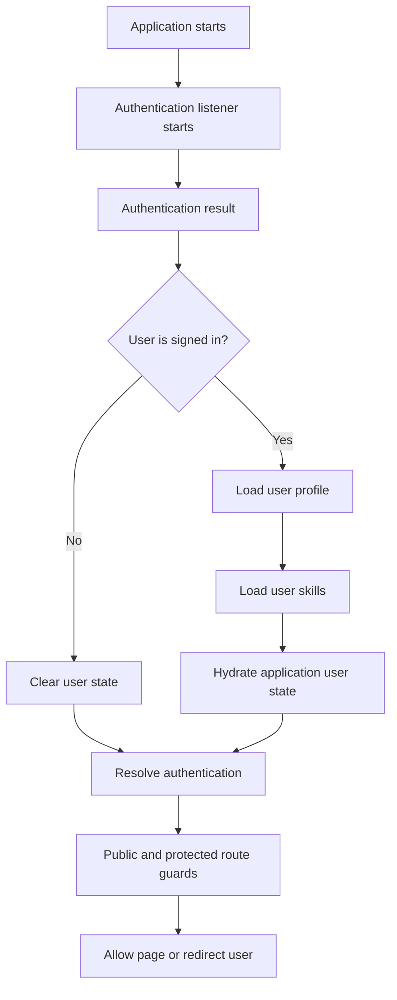
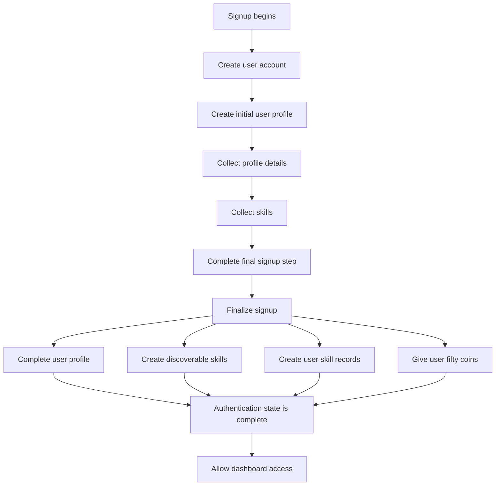
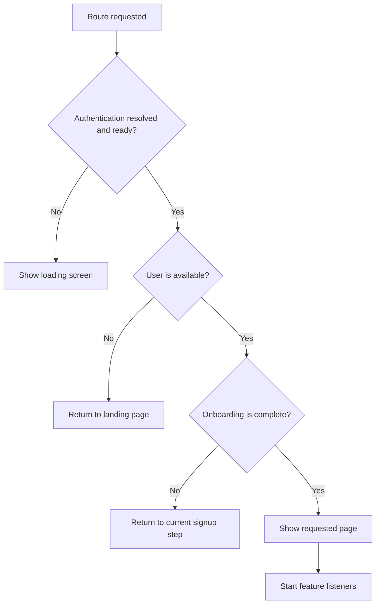

# SkillForge Authentication and Onboarding

SkillForge authentication has two layers:

1. Firebase Authentication determines whether a browser session has an authenticated Firebase user.
2. Firestore user data determines whether that authenticated user has completed onboarding and may enter the dashboard.

For the broader runtime structure, see [Architecture](./architecture.md). For the documents loaded during auth resolution, see [Firestore Data Model](./firestore-data-model.md).

## Auth State

`useAuthStore` persists its state with Zustand under the `current-user-storage` key. The important state fields are:

- `currentUser`: the hydrated SkillForge profile and user skill mirror, or `null`
- `loading`: whether an auth or auth-related operation is still in progress
- `authResolved`: whether the initial Firebase auth decision has completed
- `_authUnsubscribe`: the Firebase Auth listener cleanup function
- `loginErr` and `signupErr`: user-facing auth errors

The persisted state improves reload behavior, but Firebase remains the source of truth. On startup, `startAuthListener` subscribes to `onAuthStateChanged`, waits for `users/{uid}`, reads `users/{uid}/skills`, and then updates `currentUser`, `loading`, and `authResolved`.

If a Firebase user exists but the user document cannot be found after the retry window, the store clears `currentUser` and resolves auth as unauthenticated from the application’s perspective.

## Signup Lifecycle

Signup is coordinated by `useMultiStepsStore` and the signup components under `src/pages/auth/components`.

1. The user submits email, password, and name on the first signup step.
2. `onSignup` creates the Firebase Auth account and updates the Firebase display name.
3. `createInitialUserDoc` creates `users/{uid}` with `signupStepsCompleted: 1`.
4. The client waits for the user document and advances the local step state.
5. Subsequent steps update profile fields and skill-review data in Firestore, incrementing completion progress.
6. The final step calls `finalizeSignup`.
7. `finalizeSignup` updates the completed profile, assigns an initial balance of 50 coins, creates global skill documents, creates the user's skill mirrors, and sets `signupStepsCompleted: 4`.
8. The user can then enter `/home`.

## Route Gates

### PublicRoute

`PublicRoute` protects the landing/auth route tree from authenticated users while allowing incomplete onboarding to continue.

While `authResolved` is false or `loading` is true, it renders a loading spinner.

For an authenticated user with `signupStepsCompleted < 4`:

- `/`, `/login`, and `/signup/step-1` are explicitly allowed.
- A signup URL with a step different from the store's `currentStep` redirects to `/signup/step-{currentStep}`.
- A non-signup route redirects to `/signup/step-{currentStep}`.

For an authenticated user with `signupStepsCompleted >= 4`, every public route redirects to `/home`.

### ProtectedRoute

`ProtectedRoute` protects `/home` and its descendants.

Its decision order is:

1. If auth is unresolved or loading, render `LoadingSpinner` with the account-preparation label.
2. If `currentUser` is missing, redirect to `/`.
3. If `signupStepsCompleted < 4`, redirect to `/signup/step-{currentStep}`.
4. Otherwise, render the protected dashboard children.

The route guard uses the store's `currentStep`, not a URL-derived step calculation. Login separately sets `currentStep` to `signupStepsCompleted + 1` before navigating either to the next signup step or `/home`.

## Login and Logout

`onLogin`:

- sets `loading: true` and temporarily marks `authResolved: false`
- signs in with Firebase email/password authentication
- loads the Firestore user profile and user skills
- updates the auth store
- sets the onboarding step to `signupStepsCompleted + 1`
- navigates to the next signup step when onboarding is incomplete
- navigates to `/home` when onboarding is complete

`onSignout` signs out of Firebase and clears the application auth state. User presence is also marked offline through the presence service.

## Loading and Test Boundaries

The application intentionally does not make a route decision until the Firebase auth state is resolved. This avoids briefly showing public or protected content based only on stale persisted state.

For Playwright E2E tests, `AppInitializer` recognizes the test-only `__SKILLFORGE_E2E_SKIP_AUTH_LISTENER__` and `__SKILLFORGE_SKIP_AUTH_LISTENER__` flags. Tests seed the Zustand persistence payload before the app loads, allowing route guards to be tested without a live Firebase Auth session. This bypass is a test boundary and is not part of production authentication.

## Security Boundary

Client route guards control navigation and user experience; they are not a replacement for Firebase Auth or backend authorization. Callable Functions check `auth` and validate the authenticated UID before performing protected operations. Firestore and Functions remain the enforcement boundary for durable data access and mutations.
