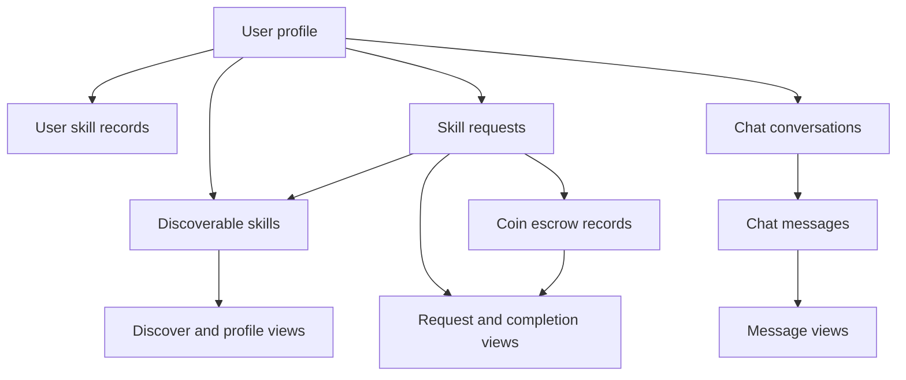
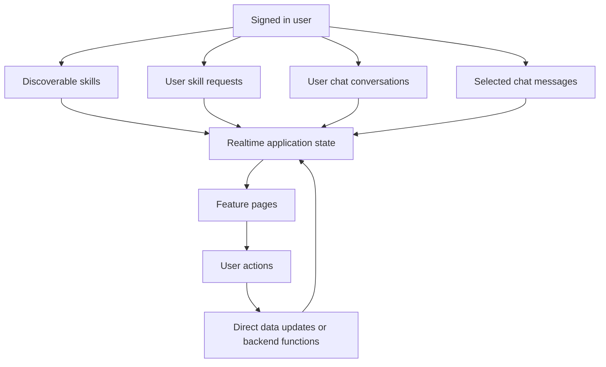

# SkillForge Firestore Data Model

SkillForge stores durable application state in Cloud Firestore and uses Firebase Authentication for identity. The frontend reads documents directly where realtime UI updates are needed; callable Cloud Functions perform authenticated, transactional, or multi-document operations.

For the system boundaries around this model, see [Architecture](./architecture.md). For how the user and onboarding documents are created, see [Authentication](./authentication.md).

## Collection Map

## `users/{uid}`

The user document is the canonical SkillForge profile for a Firebase Auth identity.

### Created during initial signup

`createInitialUserDoc` writes:

- `userId`
- `name`
- `email`
- `avatar`
- `bio`
- `role`
- `skillsReview`
- `signupStepsCompleted: 1`
- `isOnline: false`
- `lastSeenAt`

### Added or finalized during onboarding

`finalizeSignup` updates or adds:

- `userId`
- `name`
- `email`
- `role`
- `avatar`
- `bio`
- `skillsReview`
- `signupStepsCompleted: 4`
- `ratingAvg: 0`
- `ratingCount: 0`
- `coinBalance: 50`
- `createdAt`
- `isOnline: false`
- `lastSeenAt`

Profile editing and presence services can also update profile fields, online state, last-seen timestamps, and coin balance synchronization.

## `users/{uid}/skills/{skillId}`

This subcollection is the user's skill mirror. The global `skills` collection is used for discovery, while this subcollection is used to load the authenticated user's owned skills.

Current fields written by signup and profile flows include:

- `skillId`
- `skillName`
- `skillDesc` when written by profile synchronization
- `isActive`
- `createdAt`

The user mirror and global skill document are kept synchronized by profile operations. See [Architecture](./architecture.md) for the client/backend ownership boundary.

## `skills/{skillId}`

Global skills are discoverable skill records. Signup creates them through `finalizeSignup`, and profile skill operations maintain them later.

Fields include:

- `skillId`
- `skillName`
- `skillDesc`
- `ownerId`
- `ownerName`
- `ownerRole`
- `ownerAvatar`
- `learnersCount`
- `isActive`
- `createdAt`

Discover queries active skills and excludes skills owned by the current user. When a request is accepted, the owner's skill `learnersCount` is incremented.

## `skillRequests/{requestId}`

The current request model is top-level. Earlier development stored requests in a receiver-oriented user-nested structure; the current callable Functions and listener use the top-level collection.

A request contains:

- `requestId`
- `skillId`
- `skillName`
- `skillDesc`
- `owner`: `{ userId, name, role, avatar? }`
- `requester`: `{ userId, name, role, avatar? }`
- `participants`: `[ownerUserId, requesterUserId]`
- `status`: `PENDING`, `ACCEPTED`, or terminal states such as `CANCELLED`, `DECLINED`, and `COMPLETED`
- `completionStatus`: `REQUESTED` while the requester is waiting for owner confirmation, then `CONFIRMED`
- `coinAmount`: `10`
- `coinTransferId`
- `coinTransferStatus`: initially `ESCROW`
- `createdAt`
- `updatedAt`
- lifecycle timestamps such as `acceptedAt`, `completionRequestedAt`, and `completionConfirmedAt`
- `chatId` after acceptance

The global listener queries requests with `participants array-contains currentUserId` and orders them by `updatedAt` descending.

The normal lifecycle is `PENDING -> ACCEPTED -> COMPLETED`. Cancellation and decline move the request to `CANCELLED` or `DECLINED` and reverse the escrow transfer. Completion is a two-party transition: the requester sets `completionStatus: REQUESTED`, then the owner confirms it; the confirmation releases the escrow and sets `status: COMPLETED`, `completionStatus: CONFIRMED`, and `coinTransferStatus: RELEASED`.

## `coinTransfers/{requestId}`

Skill-request coin escrow uses a transfer document whose ID matches the request ID.

Fields written when a request is sent include:

- `transferId`
- `requestId`
- `skillId`
- `skillName`
- `requesterId`
- `receiverId`
- `amount: 10`
- `status: ESCROW`
- `reason: SKILL_REQUEST`
- `escrowedAt`
- `createdAt`
- `updatedAt`

`sendSkillRequest` uses a transaction to validate the requester, prevent duplicate active requests, verify the balance, decrement the requester's balance, create the request, and create this escrow document. Acceptance and completion Functions validate and update the request and transfer together.

## `chats/{chatId}`

A chat is created or updated when a skill request is accepted. The chat ID is deterministically derived from the two participants.

Fields include:

- `chatId`
- `slug`
- `participants`
- `participantDetails`: user ID to name, role, and avatar metadata
- `lastMessage`
- `deliveryState`: per-user timestamps
- `readState`: per-user timestamps
- `unreadCount`: per-user counters
- `createdAt`
- `updatedAt`

The chat summary listener queries chats where `participants array-contains currentUserId` and orders by `updatedAt` descending.

## `chats/{chatId}/messages/{messageId}`

Messages are stored under their chat. Text messages written by `sendMessage` contain:

- `messageId`
- `chatId`
- `senderId`
- `clientId`
- `type: TEXT`
- `status: SENT`
- `text`
- `createdAt`

Acceptance and other request lifecycle actions can also create `SYSTEM` messages. Thread listeners query messages ordered by `createdAt` ascending.

The client supports optimistic/offline-safe message handling. The server Function remains responsible for durable message creation and chat summary updates.

## Write Ownership

| Operation | Primary owner | Data affected |
| --- | --- | --- |
| Initial user document | `createInitialUserDoc` | `users/{uid}` |
| Signup completion | `finalizeSignup` | user, global skills, user skill mirrors |
| Profile edits | Profile store and realtime profile logic | user profile and related skills |
| Skill request creation | `sendSkillRequest` | user balance, request, coin transfer |
| Request acceptance | `acceptSkillRequest` | request, coin transfer, chat, system message, skill learner count |
| Request cancellation/decline | Callable request Functions | request and related transfer state |
| Completion request/confirmation | Callable request Functions | request, chat, transfer, participant balances |
| Message creation | `sendMessage` | message and chat summary |
| Delivery/read state | Client chat state service | chat metadata |
| Account deletion | `deleteAccount` | user document and account-related cleanup |

## Realtime Queries

The global listeners are started only after auth is resolved and a user ID is available. Feature-specific listeners are cleaned up when the feature or thread unmounts.

## Local Emulator Model

The Firebase configuration defines these local services:

- Auth: `127.0.0.1:9099`
- Firestore: `127.0.0.1:8080`
- Functions: `127.0.0.1:5001`
- Emulator UI: `127.0.0.1:4000`

The client connects to them only when `VITE_APP_ENV=e2e`. The emulator configuration currently does not specify Firestore security rules, so the emulator defaults to allowing reads and writes. Production authorization must therefore be evaluated through Firebase rules and callable Function checks rather than inferred from emulator behavior.
