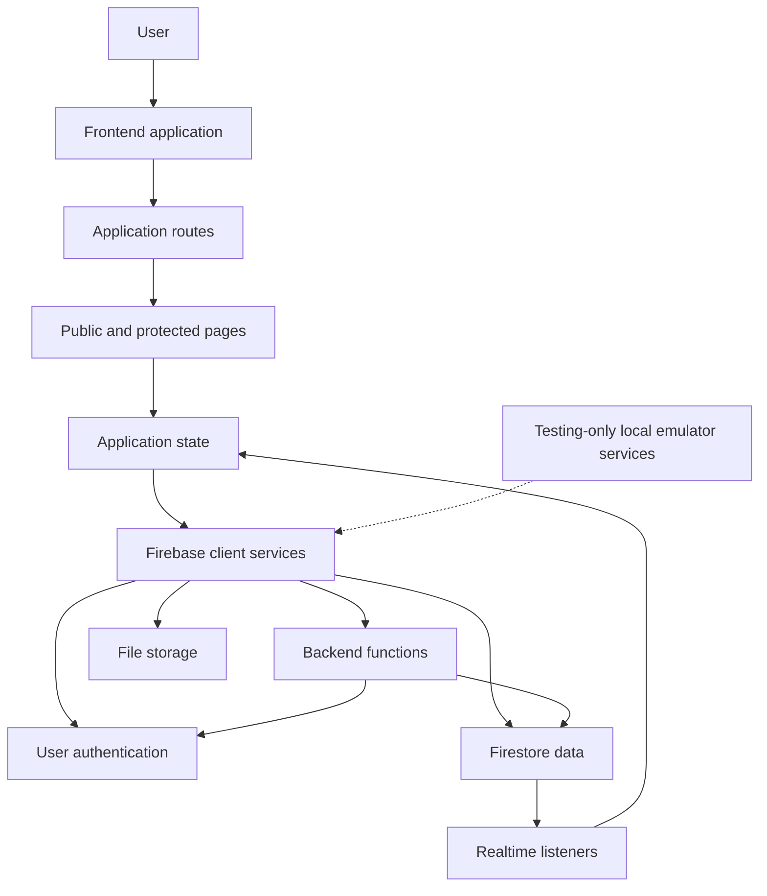

# SkillForge Overview

SkillForge is a skill-learning platform where people discover skills, request learning sessions, communicate with other users, and manage their profiles. The application combines a React frontend with Firebase Authentication, Cloud Firestore, callable Cloud Functions, Firebase Storage, and a local Firebase Emulator Suite used by end-to-end tests.

For the system structure, see [Architecture](./architecture.md). For the authentication and onboarding rules, see [Authentication](./authentication.md). For the Firestore collections and document shapes, see [Firestore Data Model](./firestore-data-model.md).

## What SkillForge Does

Users can:

- create an account and complete a four-step onboarding flow
- create and review the skills they offer
- discover other users and their active skills
- send, accept, decline, cancel, and complete skill requests
- use coins as escrow for skill requests
- communicate through chat after a request is accepted
- manage their profile, skills, settings, theme, and account

The current dashboard is organized around `/home`, with dedicated views for discovery, skill requests, messages, profile, and settings.

## Current System

The browser owns presentation, navigation, local UI state, and optimistic interaction state. Firestore provides durable application data and realtime updates. Callable Functions own operations that require server-side validation, transactions, or coordinated writes, such as finalizing signup, sending skill requests, settling request state, and sending messages.

## Main Runtime Boundaries

### Frontend

The frontend starts at `src/main.tsx` and renders `App`. `App` initializes the theme, mounts `AppInitializer`, installs the router, and provides the skills context. Routes are defined in `src/routes/AppRoutes.tsx`.

Public routes are hosted under the landing layout:

- `/`
- `/login`
- `/signup/:slug`

Authenticated dashboard routes are hosted under `/home`:

- `/home`
- `/home/discover`
- `/home/skill-requests`
- `/home/messages`
- `/home/messages/thread/:slug`
- `/home/profile`
- `/home/settings`

Large route components are lazy-loaded and display feature-specific skeletons while they load. For the layer-by-layer structure, see [Architecture](./architecture.md).

### Authentication and onboarding

Firebase Auth identifies the user. SkillForge then loads the matching `users/{uid}` document and the user's `users/{uid}/skills` subcollection into the persisted Zustand auth store.

A user is considered fully onboarded only when `profile.signupStepsCompleted >= 4`. Until then, route guards keep the user in the signup flow. The complete decision tree is documented in [Authentication](./authentication.md).

### Backend operations

The Functions backend exports callable operations for:

- initial user document creation
- signup finalization
- account deletion
- the skill-request lifecycle
- chat message creation

The skill-request Functions also coordinate coin escrow, chat creation, system messages, participant checks, and learner counts. See [Firestore Data Model](./firestore-data-model.md) for the persisted effects of these operations.

### Realtime behavior

`AppInitializer` starts global listeners after authentication is resolved:

- active skills for Discover
- skill requests involving the current user
- chat summaries involving the current user
- user presence and chat delivery updates

Profile realtime synchronization is mounted by the profile feature. A chat thread mounts listeners for the chat document and its ordered messages.

## Architectural Evolution

SkillForge has evolved through the following stages:

1. **Initial application shell**: Vite, React, TypeScript, Firebase Auth, Firebase Storage, theme support, and a responsive landing page were established.
2. **Authentication and dashboard**: Firebase email/password authentication, protected routes, the dashboard layout, settings, and the first authenticated user experience were added.
3. **Discover and request beginnings**: Discover became data-driven, and skill requests initially lived in a receiver-oriented user document structure.
4. **Top-level request model and Functions**: The request flow moved to the top-level `skillRequests` collection, and callable Functions were added for the complete request lifecycle and chat bootstrap.
5. **Messaging**: Chat summaries, thread messages, delivery/read state, optimistic sending, and an offline-safe outbox were introduced.
6. **Profile and coins**: Realtime profile and skill editing were added, followed by coin escrow and completion settlement for skill requests.
7. **Performance and test infrastructure**: Lazy routes, skeleton states, Firestore listener cleanup, Jest coverage, Playwright projects, Firebase emulators, and CI support were added.
8. **Current auth and loading hardening**: Auth resolution state, onboarding redirect enforcement, browser-stable auth-gate tests, and broader loading-state UX were strengthened.

The current architecture preserves the original Firebase-centered direction while moving security-sensitive multi-document workflows into callable Functions and keeping read-heavy UI updates realtime through Firestore listeners.

## Related Documentation

- [Architecture](./architecture.md)
- [Authentication](./authentication.md)
- [Firestore Data Model](./firestore-data-model.md)
